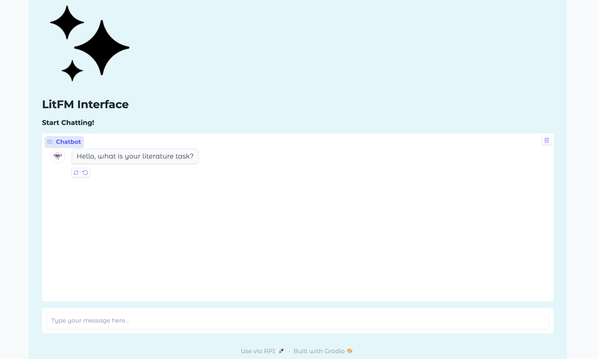

# LitFM



### **Pipeline Overview**
1. **`citation_graph.py`**: Processes a citation graph stored in a **GEXF file**, where each node represents a research paper with the following attributes:
   - Full paper content
   - Extracted "Related Work" sections
   - Citation relationships (which paper cites which)
   - Citation sentences that explain how one paper references another

2. **`Lora_finetune.py`**: Prepares **downstream tasks** for fine-tuning the LLM using the extracted data.

3. **Fine-Tuned LLM**: Once trained, the user can interact with the LLM via a **Gradio web interface**, asking for literature-related tasks such as citation prediction, title generation, and abstract completion.

---
## **Downstream Tasks for Fine-Tuning**

### 1️⃣ **Link Prediction (LP)**
**Task:** Predict whether **Paper A will cite Paper B**.

### 2️⃣ **Abstract-to-Title Generation**
**Task:** Generate a title for a paper based on its abstract.

### 3️⃣ **Paper Recommendation & Citation Prediction**
**Task:** Given a query paper, **select the most relevant candidate paper** that it is likely to cite.
- This task trains a model to **recommend citations**.
- The model learns to **distinguish relevant citations** from irrelevant ones (negative samples).

### 4️⃣ **Citation Sentence Generation**
**Task:** Generate a citation sentence explaining how **Paper A cites Paper B**.

### 5️⃣ **Abstract Completion**
**Task:** Predict and complete the remaining portion of an abstract given an incomplete version.

### 6️⃣ **Title to Abstract Generation**
**Task:** Generate an abstract based on a given title.

---
## **How to Run the Project**

### **Step 1: Process the Citation Graph**
Run the following command to create the citation graph:
```bash
python citation_graph.py
```
This script will process the citation relationships, prepare the dataset and fine-tune Llama 3.2B on the tasks described above.

### **Step 2: Interact with the Fine-Tuned LLM**
Once the training completes, a **Gradio web interface** will be launched and a **public link (.gradio.live)** will be generated. Users can use this link to interact with the fine-tuned model.

---
## **Usage Notes**
- After the **first user interaction**, the citation graph is fetched, and the fine-tuning begins.
- Once fine-tuning is complete, the user can **ask the chatbot any literature-related task**.
- **IMPORTANT**: In this phase of the project, the **user prompts must follow the instruction format of the training dataset** to ensure high-quality responses.

